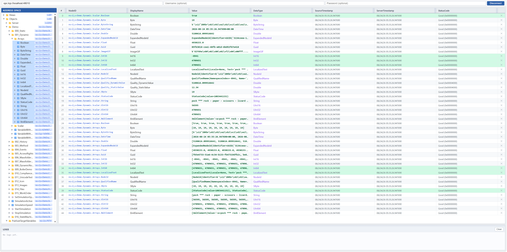

# OPC UA Web Client | Industrial OPC UA Browser | Read/Write & Subscription Tool

OPC UA Web Client is an open-source web-based OPC UA client built with Python, FastAPI, and asyncua. It helps engineers connect to OPC UA servers, browse the OPC UA address space, read and write node values, and monitor real-time data through OPC UA subscriptions. This project supports common industrial automation workflows such as device diagnostics, process data monitoring, and remote OPC UA data access.

It also provides advanced capabilities for complex OPC UA data, including array IndexRange subscription, multi-dimensional array handling, and structured/custom data type visualization and editing. If you are searching for an OPC UA browser, OPC UA monitor, OPC UA read write client, or a Python OPC UA example project, this repository is designed as a practical, production-oriented reference.

## Keywords

OPC UA, OPC UA Client, OPC UA Web Client, OPC UA Browser, OPC UA Subscription, OPC UA Read Write, OPC UA Address Space, OPC UA IndexRange, OPC UA Structured Data, OPC UA Custom DataType, Industrial Automation, SCADA Integration, Python OPC UA, asyncua, FastAPI, OPC TCP Client, Real-time Monitoring, IIoT Data Access, OPC UA Monitoring Mode, OPC UA Publishing Enabled

## Features

- Connect / disconnect OPC UA Server
- Address space browsing (tree expansion)
- Subscribe to node changes
- IndexRange subscription (right-click menu → Item Settings, supports `n`, `n:m`, `n:m,n:m` formats)
- Read/Write node attributes (right-click → Read/Write Attributes…), with a structured, hierarchical editor for scalars, arrays (including multi-dimensional arrays), and structured/nested values (e.g. custom structs, `NodeId`, `QualifiedName`, `LocalizedText`)
- Subscription Settings (right-click → Subscription Settings…), configure the OPC UA subscription's Publishing Interval, Keep Alive Count, Lifetime Count, Max Notifications per Publish, Priority, Timestamps To Return and Publishing Enabled
- Monitored Item Settings (right-click a monitored row → Monitored Item Settings…), configure a single monitored item's Sampling Interval, Queue Size, Discard Oldest and Monitoring Mode
- Auto-resubscribe: monitored items are automatically re-subscribed after a disconnect/reconnect cycle

## Usage Guide

### 1. Connect to a server

1. Enter the server endpoint URL in the top input box, e.g. `opc.tcp://localhost:4840`.
2. If the server requires authentication, fill in **Username** / **Password** (optional).
3. Click **Connect**. The status badge in the top-right turns green (`Connected`) once successful.

### 2. Browse the address space

- The left panel **Address Space** shows the server's node tree. Click the arrow/folder icon to expand a node.
- Nodes are lazily loaded — children are only fetched from the server when you expand a branch.

### 3. Add nodes to the monitor table

There are three ways to start monitoring a node (right panel):

- **Drag and drop**: Drag a `Variable` node from the tree directly onto the right-hand table.
- **Right-click → Add Monitor Item…**: Right-click anywhere on the table, then type in a NodeID manually (e.g. `ns=2;s=Demo.Dynamic.Scalar.Int32`).
- Once added, the node's value updates in real time via WebSocket push whenever it changes on the server.

Double-click a row's **Value** cell to open the **Array Viewer** modal, which is useful for inspecting large arrays or nested/structured values.

### 4. IndexRange (subscribe to a sub-range of an array)

IndexRange lets you subscribe to only part of an array value instead of the whole array — useful for large or structured arrays where you only care about a few elements.

1. Right-click the row of an already-monitored array node, then choose **Index Range…**.
2. Check **Enable IndexRange**.
3. Enter a range in the **IndexRange** field using one of the following formats:
   - `n` — a single element, e.g. `0`
   - `n:m` — a contiguous range, e.g. `0:9` (elements 0 through 9)
   - `n:m,n:m` — multi-dimensional arrays, e.g. `0:4,0:1` `1:4,2:3,1:2` 
4. Click **Apply**. The client unsubscribes the old item and re-subscribes with the new IndexRange; the row's badge (e.g. `[0:9]`) reflects the active range.
5. Uncheck **Enable IndexRange** and click **Apply** to go back to subscribing the full array value.

### 5. Read/Write node attributes

Every node (in the address space tree, or already added to the monitor table) has a full set of readable/writable OPC UA attributes, viewable in a single dialog:

1. Right-click a node in the **Address Space** tree, or a row in the monitor table, then choose **Read/Write Attributes…**.
2. The dialog lists all attributes the node exposes (NodeId, BrowseName, DataType, AccessLevel, Value, etc.).
3. For the **Value** attribute:
   - A plain scalar shows an inline editable input — edit it and click **Write**.
   - Arrays and structured values (structs, `NodeId`, `QualifiedName`, `LocalizedText`, arrays of structs, and multi-dimensional arrays) open the **Array/Struct Viewer**, which renders the value as an expandable hierarchical tree. Any editable leaf field has its own input; click **Write** to send the edited value back to the server, preserving the original type and array shape/dimensions.
   - Read-only fields (e.g. `NodeId` sub-fields) are shown but cannot be edited.
4. Click **Refresh** to reload the current attribute values from the server.

### 6. Subscription Settings

The monitor table is backed by a single shared OPC UA subscription. You can configure its parameters directly:

1. Right-click anywhere on the monitor table (row or empty area), then choose **Subscription Settings…**.
2. The dialog shows the current subscription configuration:
   - **Subscription Name** — a client-side-only label for display purposes (not part of the OPC UA protocol).
   - **Subscription Id** — read-only, assigned by the server once the subscription is created.
   - **Publishing Interval (ms)**, **Keep Alive Count**, **Lifetime Count**, **Max Notifications per Publish**, **Priority** — standard OPC UA subscription parameters; editable at any time.
   - **Timestamps To Return** — `Source` / `Server` / `Both` / `Neither` / `Invalid`, applied to newly created monitored items.
   - **Publishing Enabled** — toggles whether the subscription delivers notifications.
3. Click **Apply**. If a subscription is already active, it is updated in place (via the OPC UA `ModifySubscription` / `SetPublishingMode` services) and the server's revised values are shown back; otherwise the settings are stored and used the next time an item is subscribed.

### 7. Monitored Item Settings

Each monitored item can also be reconfigured individually, independent of the shared subscription's settings:

1. Right-click a row in the monitor table, then choose **Monitored Item Settings…**.
2. The dialog shows the item's current configuration:
   - **Node Id** — read-only, identifies the monitored node.
   - **Sampling Interval (ms)** — how often the server samples the value.
   - **Queue Size** — number of queued notifications per publish (default `1`).
   - **Discard Oldest** — whether the oldest queued value is discarded when the queue is full.
   - **Monitoring Mode** — `Disabled` / `Sampling` / `Reporting`.
3. Click **Apply**. Sampling Interval, Queue Size and Discard Oldest are updated via the OPC UA `ModifyMonitoredItems` service (the server's revised values are shown back); Monitoring Mode is updated via `SetMonitoringMode`, applied only to this item.

### 8. Remove monitored items

- Click the ✕ icon at the end of a row to remove a single item.
- Right-click → **Clear All** removes every monitored item at once.

## Getting Started

```bash
# Start backend (hot reload)
python main.py
```

Open http://127.0.0.1:9003 in your browser.



## Docker

```bash
# Build image
docker build -t opcua-web-client .
```

Open http://127.0.0.1:9003 in your browser.

## Packaging as a Single EXE

The packaged exe can run directly on Windows x64 machines without a Python environment.

```bash
pip install pyinstaller

# Package (generates dist\OpcUaWebClient.exe)
pyinstaller OpcUaWebClient.spec

# Repackage (after code changes)
pyinstaller OpcUaWebClient.spec --clean
```

The packaged artifact is located at `dist\OpcUaWebClient.exe` (about 24 MB). Double-click to run, then open http://127.0.0.1:9003 in your browser.

> **Tip:** The first launch is slightly slower (PyInstaller extracts to a temporary directory), and Windows Defender may trigger a scan — this is normal.
